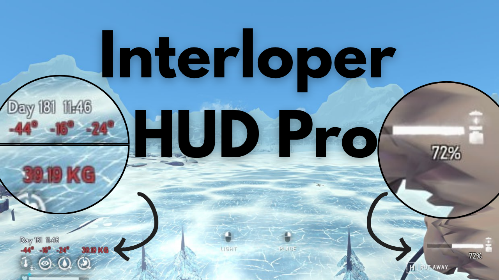

## Interloper Hud Pro

Interloper HUD Pro enhances your survival experience on Great Bear Island by adding vital stats directly to your HUD — including:
* Date & Time
* Real-time Temperature
* Inventory Weight
* Active Item Condition

Stay informed. Stay alive.

## 📊 Features
| Feature | Description |
|----------|--------------|
| 🕒 **Day & Time** | Displays the in-game day and time |
| 🌡️ **Temperature** | Shows `Air Temp` / `Wind Chill` / `Feels like` temperatures Temperature text turns red when `Feels like` goes negative This is absolutely critical info at Interloper/Misery difficulty to avoid: * 20%/hr cold damage * Hypothermia |
| 🎒 **Inventory Weight** | Keep track of your current carry load |
| 🔧 **Active Item Condition** | Know your item’s remaining durability at a glance   Especially useful to eek out maximum utility for your Torches |

## Installation Notes

* Install The Long Dark
* Install Melon Mod
* Copy `InterloperHudPro.dll` into your `Mods` folder inside your game directory.
* * e.g. for steam users: `C:\Program Files (x86)\Steam\steamapps\common\TheLongDark\Mods\`
* Start your game
* Your Interloper HUD Pro will automatically load. No additon configuration required

Launch The Long Dark — your new HUD should appear automatically.

